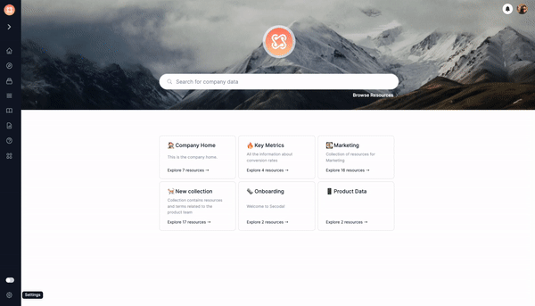

# What is Secoda?

Secoda is the place where all your data knowledge lives. With Secoda, everyone on your team can make sense of all your company data in one intuitive, collaborative, and searchable platform.

## How does Secoda Integrate into your data?

Secoda integrates with your databases, data warehouses and BI tools to fetch metadata, query history and activity from data sources to make it easier to share and document data knowledge with stakeholders.

As soon as the metadata and query history have been added to Secoda, they are compiled into a unified metadata store by way of a query parser. By parsing queries, we look at what data is there, where it is, and how it is used.

Secoda calculates popularity by taking into account the queries that have been used, the queries that haven't been used, and by who used what. Secoda also takes a look at how assets within Secoda are being used to improve popularity over time. Secoda shows popularity on every data object in the database and BI system.

By default, all columns in a table, all tables in a database, all dashboards in a BI tool will be ordered by the popularity in Secoda so you can always see what's being used most frequently. Metadata extraction is based on your schedule, which is created at the time of extraction, and will update the popularity, queries, and users of the resource.

If queries are available, the tables, databases and dashboards will display a data column and table level lineage model, to easily see from one place what the data dependencies are, where the data came from, and where it's being used.

Using Secoda, data teams can define dictionary terms, metrics, queries, docs, answers to common questions and workflow so they can organize and describe their data across all their data tools from one central location.

## Getting Started

**Got a few minutes?** Check out a video overview of our product:




**Good to know:** Not all integrations are the same and some are tougher to integrate without some help. If you have trouble connecting or setting up your workspace, please reach out to us at hello@secoda.co or in our [Slack communtiy](https://join.slack.com/t/secodacommunity/shared\_invite/zt-mhnu278g-FktKZmZ51SDQtlu3NRAxqg)


### Guides: Jump right in

Follow our handy guides to get started on the basics as quickly as possible:


[connect-your-data.md](getting-started/connect-your-data.md)



[define-service-accounts.md](getting-started/define-service-accounts.md)



[hide-unwanted-datasets.md](getting-started/hide-unwanted-datasets.md)



**Good to know:** your product docs aren't just a reference of all your features! use them to encourage folks to perform certain actions and discover the value in your product.


### Fundamentals: Dive a little deeper

Learn the fundamentals of MyProduct to get a deeper understanding of our main features:


[Broken link](broken-reference)



[Broken link](broken-reference)



[Broken link](broken-reference)



[Broken link](broken-reference)



**Good to know:** Splitting your product into fundamental concepts, objects, or areas can be a great way to let readers deep dive into the concepts that matter most to them. Combine guides with this approach to 'fundamentals' and you're well on your way to great documentation!

