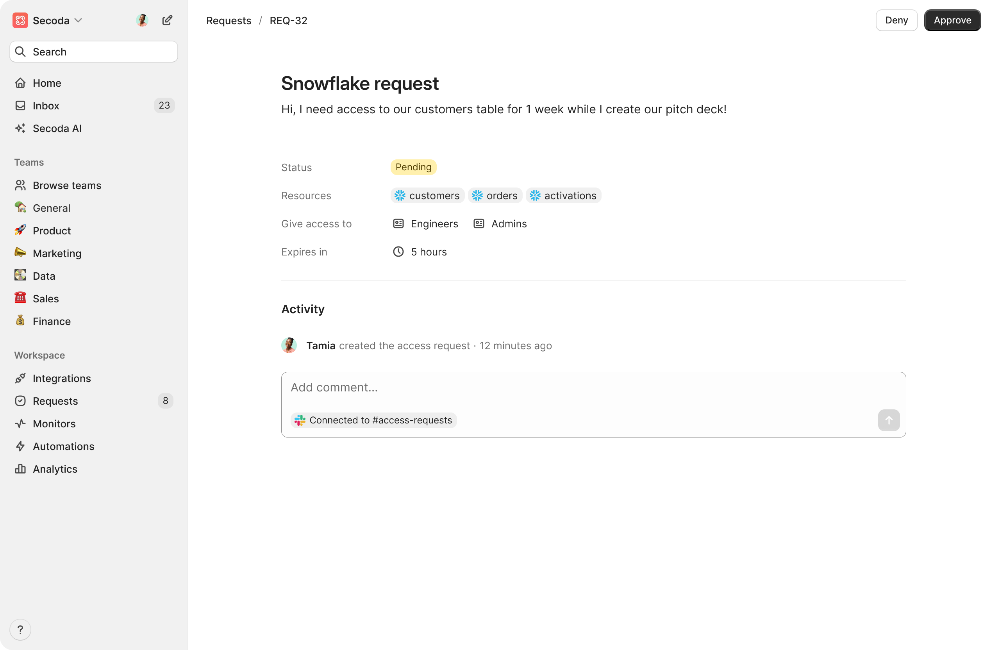

# Access Requests \[WIP]

The Access Requests feature in Secoda simplifies and centralizes the process of requesting, approving, and auditing access to data resources across multiple platforms. This feature helps organizations eliminate fragmented workflows, enhance security, and streamline compliance.

### Key Features

* **Centralized Requests**: Users can create Data Access Requests (DARs) directly within Secoda, specifying the resources, access duration, and roles.
* **Automated Provisioning & Revocation**: Upon approval, access is provisioned automatically and revoked after the expiration period, reducing manual effort and improving security.
* **Detailed Audit Logs**: Track every access request, including resources, requester, roles, reviewers, and expiration timelines, ensuring transparency and compliance.
* **Identity Management**: Admins can browse and manage all ingested identities (users and roles) from integrated platforms.
* **Slack Integration**: Configure a dedicated Slack channel for access request notifications. Approvals can be handled directly in Slack with a ✅ reaction.
* **Secoda AI Integration**: Easily query Secoda AI to check if a specific user has access to a particular resource.

### How It Works

1.  **Creating a Request**: Users can create a Data Access Request from Secoda specifying:

    1. Resources they want access to.
    2. An optional reason for access.
    3. An optional expiration period for access.

    <figure><figcaption></figcaption></figure>
2. Review & Approval:
   1. Reviewers evaluate the request and choose the role or identity to update.
   2. Requests can be approved via the Secoda interface or Slack.

<figure><figcaption></figcaption></figure>

<figure><figcaption></figcaption></figure>

3. Access Management: Upon approval:
   1. Access is granted automatically to the specified identity.
   2. Access is revoked automatically after the expiration period.

<figure><figcaption></figcaption></figure>

### Getting Started

1. Setup Integrations: Connect supported platforms to Secoda to ingest user and role identities.
2. Configure Slack Channel: Enable the “Access Requests” channel for real-time notifications and approvals.
3. Manage Roles: Assign the Reviewer role to appropriate team members to streamline the review process.
4. Track Requests: Use the Access Requests dashboard to monitor, audit, and manage requests.

### Supported Integrations

Access Requests will be support the following platforms during the Beta period:

#### Data Warehouses

* Snowflake
* BigQuery
* Redshift
* Databricks

#### Business Intelligence

* Tableau
* Looker
* Power BI
* Sigma

### Beta Availability

The Access Requests feature will be available in public beta starting December 16 until February 2025. Feedback during this period will help shape the final release.

### Use Cases

* Data Access Governance: Ensure that only authorized users can access sensitive data and that access is tracked and time-bound.
* Streamlined Collaboration: Simplify the process of granting access to analysts, data scientists, or other team members needing data for their workflows.
* Enhanced Compliance: Maintain detailed audit trails for all access requests, meeting regulatory and organizational compliance needs.
