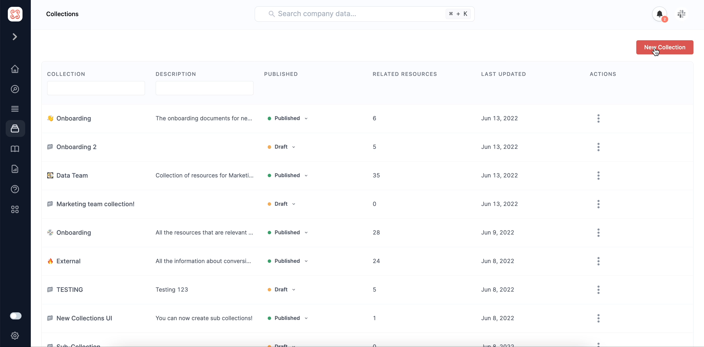

# Creating sub collections

You can create subcollections in Secoda. You can develop sub-collections by creating a new collection and assigning it to another collection in the dropdown menu, as presented below:


Not using Secoda to manage your data knowledge yet? Sign up for free [here](https://app.secoda.co) 👈

