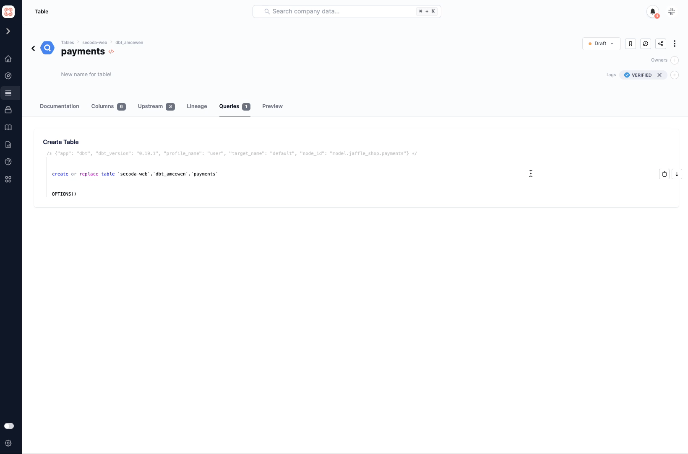

# Documenting Queries

By clicking on queries in Secoda, you can add documentation to them and share them with others. In addition, you can also add the following documentation to queries:&#x20;

* Add queries to collections
* Add tags to queries
* Add owners to queries
* Change the query name and description
* Bookmark queries
* Add queries to groups
* Verify queries

Below is an example of how you can easily document queries in Secoda:

