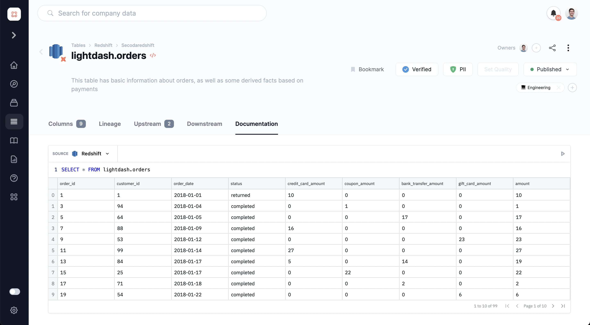

# Running Queries in Secoda

## How to Run a Query in Secoda

By pressing the /query command, editors can embed live queries into table documentation, dictionary terms, docs, questions and collections.&#x20;

### Steps to running queries

1. Add a query block using the /query command&#x20;
2. Select a "source" from the top left of the query block
   1. Ensure that the source has been given the correct [permissions](../../user-management/resource-permissions.md)
3. Write your query and press the execute button on the right have side
4. Sort query and share it with the viewer you want to see the query

### Scheduling queries

Using the "schedule" tab, you can set a schedule for your queries to run in Secoda. This can ensure that viewers who are looking at your query results are seeing up to date results that they can trust.&#x20;

### Sharing queries with viewers

These queries are useful for showing viewers how to use queries or if editors want to share / document queries for viewers. As a viewer, I am only able to execute the query if I have [permissions](../../user-management/integration-permissions.md).&#x20;

As a viewer, If I don't have integration permission, I will only be able to view the result of the query and download a CSV with the results that have been shared with me.&#x20;


Not using Secoda to manage your data documentation yet? Sign up for free [here](http://app.secoda.co/) 👈

