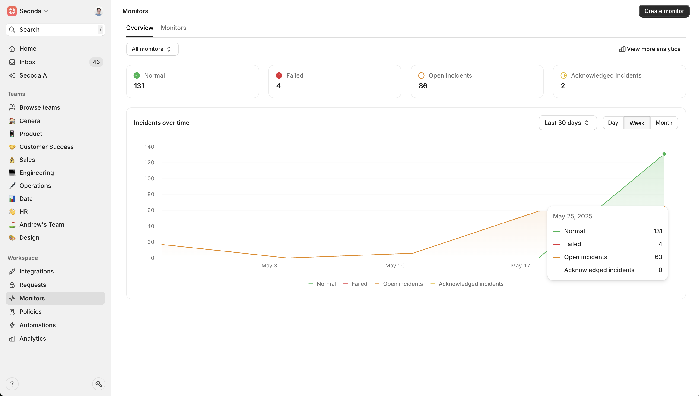

# Entity Relationship Diagram


Entity Relationship Diagrams are currently in Early Access. Sign up [here](https://tally.so/r/mK4x1D) to get access.&#x20;


<figure><figcaption></figcaption></figure>

### Overview

Entity Relationship Diagrams (ERDs) give a clear, interactive view of how tables and their columns are used together in data warehouses and databases. By automatically detecting table relationships, ERDs help you choose the right data, write accurate joins, and explain your model to anyone on the team.

### How Secoda builds ERDs

Secoda analyses join patterns in your warehouse and any declared constraints to infer primary-key and foreign-key links with no manual modelling required. The diagram updates automatically as schemas change, and you can pan, zoom, filter, or export when you need to share.

### Using ERDs

1. Select any table or view in Secoda.
2. Click the **Usage** tab.
3. Click on the **ERD** button on the right side
4. Use the toolbar to search, zoom, or export.

> **Tip**: Filters help you focus on a specific schema or hide lookup tables when the diagram is large.

### ERDs vs Lineage

| Purpose       | ERD                                       | Lineage                                |
| ------------- | ----------------------------------------- | -------------------------------------- |
| View          | Tables & keys                             | Data flow between systems              |
| Generation    | Join patterns and constraints             | Creation queries                       |
| Typical tasks | Data modelling, documentation, onboarding | Impact analysis, debugging, governance |

Used together, ERD shows how to use tables together, while lineage shows how it moves. Start with the ERD to grasp structure, then switch to lineage to trace transformations or downstream impact.

### Common use cases

* **Data modelling** – design or review schema changes visually
* **Onboarding** – give newcomers a fast mental map of the warehouse
* **Query optimisation** – confirm correct join paths before running code
* **Governance** – surface unexpected relationships during audits
* **Compliance** – provide evidence of approved links during assessments

### FAQ

**Do I need to tag keys manually?**\
No. Secoda infers relationships from query history and database constraints.

**How often does the ERD refresh?**\
The diagram updates automatically after every metadata sync.

**Can I export the diagram?**\
Yes. Use the export button to save a PNG or PDF for sharing.
