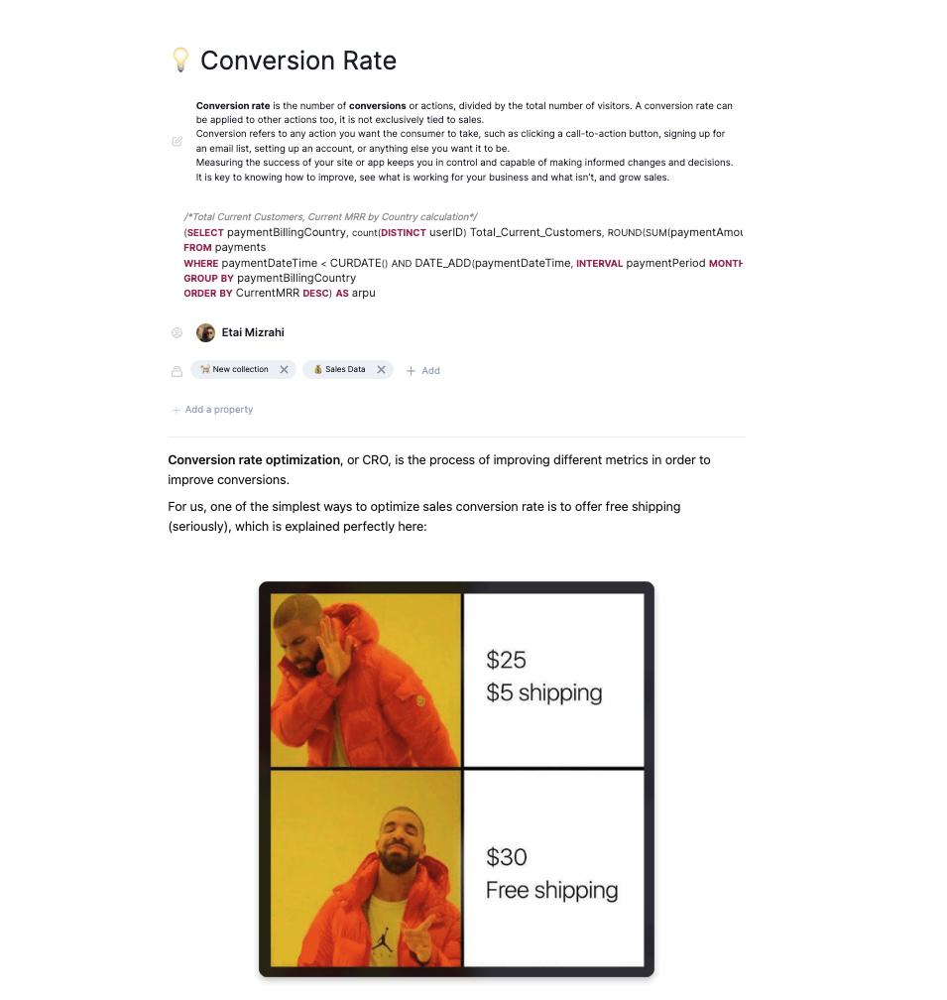

# Creating a Data Dictionary

## Using Secoda's Data Dictionary

Secoda's data dictionary is one place for all of your data terms. Terms in your data dictionary will be visible via Secoda's search, and you can search directly in the dictionary. You can also tag terms across your workspace&#x20;


**Good to know:** The Data Dictionary is different from the Documents feature in that it has set fields (i.e. terms, definition, owner) and is one place for all of your data terms. \
\
Documents, on the other hand, have open fields (customizable) and allow you to provide more context on specific tables or datasets.&#x20;

