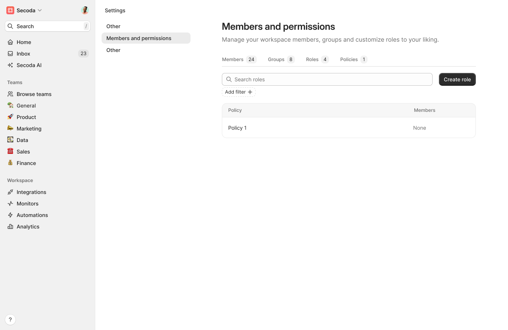

# Policies \[WIP]

### Introduction[​](https://datahubproject.io/docs/authorization/policies#introduction) 

Secoda provides the ability to declare fine-grained access controls through Policies. Some examples of policies that can be created are

* Dataset Owners should be allowed to edit documentation, but not Tags.
* Jenny, our Data Steward, should be allowed to edit Tags for any Dashboard, but no other metadata.
* James, a Data Analyst, should be allowed to edit the Related Resources for a specific Data Pipeline he is a downstream consumer of.
* The Data Platform team should be allowed to manage users & groups, view platform analytics, & manage policies themselves.


Policies are only enabled for Premium and Enterprise tiers.


### What is a Policy?[​](https://datahubproject.io/docs/authorization/policies#what-is-a-policy) 

Policies consist of a set of permissions (see all permissions below) that can be applied to Roles which are applied to users. There are 2 types of Policies within Secoda:

1. Platform Policies
2. Resource Policies

#### Platform Policies[​](https://datahubproject.io/docs/authorization/policies#platform-policies) 

**Platform** policies determine who has platform-level permissions on Secoda. Examples of these permissions include

* Managing Users & Groups
* Viewing the Secoda Analytics
* Managing Policies&#x20;

Platform policies consist of just permissions, e.g, "Can view Analytics". Platform policies do not include a specific "target resource" against which the Policies apply. Instead, they simply serve to assign specific permissions.

#### Resource Policies[​](https://datahubproject.io/docs/authorization/policies#metadata-policies) 

**Resource** policies determine who can do what to which Resources. For example,

* Who can edit Tables Documentation & Related Resources?
* Who can add Owners to a Chart?
* Who can add Tags to a Dashboard?

A Resource Policy can be broken down into 2 parts:

1. **Resources**: Which Resources that the policy applies to, e.g. "All Tables".
2. **Permissions**: What actions are being permitted by a policy, e.g. "Add Tags".

**Resources**[**​**](https://datahubproject.io/docs/authorization/policies#resources)

Subsets of resources can be associated with the policy by leveraging [filters.md](filters.md "mention"). This uses the same capabilities that the filters in search, catalog, and many places in the application uses. Some examples of filters include:

1. Resources from a specific integration, e.g, Snowflake
2. Resources of a specific type, e.g, Tables
3. Resources that contain a specific tag
4. Resources that are marked as PII

### Managing Policies[​](https://datahubproject.io/docs/authorization/policies#managing-policies) 

Policies can be managed on the page **Settings > Members > Policies** tab. The `Policies` tab will only be visible to those users having the `Manage Policies` privilege.

Out of the box, Secoda is deployed with a set of default Policies. The set of default policies are Viewers, Editors, and Admins.

<figure><figcaption></figcaption></figure>

### Permissions[​](https://datahubproject.io/docs/authorization/policies#reference) \[WIP] 

#### Platform-level permissions[​](https://datahubproject.io/docs/authorization/policies#platform-level-privileges) 

These permissions are for Secoda operators to access & manage the administrative functionality of the system.

**Access & Credentials**[**​**](https://datahubproject.io/docs/authorization/policies#access--credentials)

| Permission            | Description                                                                                                                  |
| --------------------- | ---------------------------------------------------------------------------------------------------------------------------- |
| Generate API Keys     | Allow user to generate personal access tokens for use with Secoda APIs.                                                      |
| Manage Policies       | Allow user to create and remove access control policies. Be careful - Users with this privilege are effectively super users. |
| Manage Users & Groups | Allow user to create, remove, and update users and groups on Secoda.                                                         |
| Manage Integrations   | Allow user to manage integrations to Secoda.                                                                                 |

**Product Features**[**​**](https://datahubproject.io/docs/authorization/policies#product-features)

| Permission                | Description                                                                    |
| ------------------------- | ------------------------------------------------------------------------------ |
| Manage Features           | A catch-all for all features                                                   |
| Manage Properties         | Allow user to create, update, delete Properties                                |
| Manage Monitors           | Allow a user to create, update, delete Monitors                                |
| Manage Automations        | Allow a user to create, update, delete Automations                             |
| Manage Analytics          | Allow a user to create, update, delete Analytics Reports                       |
| Manage Views              | Allow user to create, update, and delete any Views.                            |
| Manage Questions          | Allow a user to mark question as answered.                                     |
| Manage Workspace Settings | Allow user to view and change platform-level settings, like security settings. |
| View Analytics            | Allow user to view the Secoda analytics dashboard.                             |
| View Monitors             | Allow user to create, update, and delete any Monitors.                         |

**Resource Management**[**​**](https://datahubproject.io/docs/authorization/policies#entity-management)

| Permission         | Description                                           |
| ------------------ | ----------------------------------------------------- |
| Manage Teams       | Allow user to create and remove Teams.                |
| Manage Glossary    | Allow user to create, edit, and remove Glossary Terms |
| Manage Collections | Allow user to create, edit, and remove Collections    |
| Manage Tags        | Allow user to create and remove Tags.                 |

**Resource Permissions**[**​**](https://datahubproject.io/docs/authorization/policies#entity-privileges)

| Permission      | Description                                                                                 |
| --------------- | ------------------------------------------------------------------------------------------- |
| View Resource   | Allow user to view the resource page.                                                       |
| Edit Resource   | Allow user to edit any information about an resource. Super user privileges for the entity. |
| Delete Resource | Allow user to delete this resource.                                                         |
| Create Resource | Allow user to create a resource if it doesn't exist.                                        |

**Property Permissions**[**​**](https://datahubproject.io/docs/authorization/policies#aspect-privileges)

| Permission             | Description                                                   |
| ---------------------- | ------------------------------------------------------------- |
| Edit Tags              | Allow user to add and remove tags to a resource.              |
| Edit Collections       | Allow user to add and remove collections to a resource.       |
| Edit Description       | Allow user to edit the description of a resource.             |
| Edit Documentation     | Allow user to edit documentation associated with a resource.  |
| Edit Status            | Allow user to edit the status of a resource.                  |
| Edit Teams             | Allow user to edit the Teams of a resource.                   |
| Edit Custom Properties | Allow user to edit the Custom Properties of a resource.       |
| Edit Lineage           | Allow user to add and remove lineage edges for this resource. |
| Edit Owners            | Allow user to add and remove owners of a resource.            |
| Edit PII               | Allow a user to update the PII of a resource.                 |
