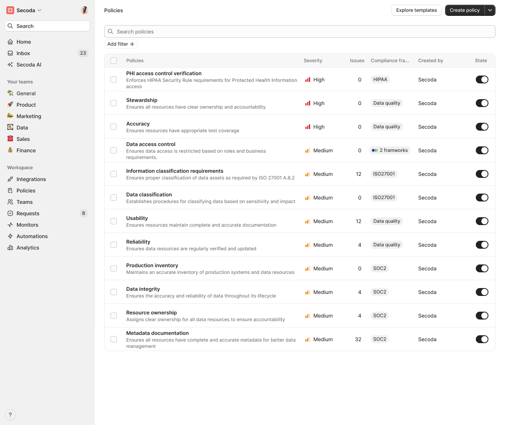

# Policies


Policies are currently in Early Access. To get access you can fill out the early access form [here](https://tally.so/forms/3NdaVQ).


Policies in Secoda help organizations enforce data governance rules and maintain compliance across their data stack. With policies, teams can monitor, validate, and enforce data standards systematically.

<figure><figcaption></figcaption></figure>

### Overview

Policies provide a structured way to:

* Define and enforce data governance rules
* Monitor compliance across your data resources
* Track and remediate policy violations
* Ensure data quality and security standards

### Creating Policies

To create a new policy:

1. Navigate to the Policies page
2. Click the "Add Policy" button
3. Define your policy details:
   * Name: Give your policy a descriptive name
   * Icon: Choose an icon to represent your policy (optional)
   * Description: Explain the purpose and requirements of your policy
4. Add filteres for resources that are governed by the policy, e.g., Snowflake production table
5. Add conditions that must be met by the resources, e.g., Has owner

<figure><figcaption></figcaption></figure>

### Policy Components

<figure><figcaption></figcaption></figure>

#### Overview Tab

The overview tab contains the primary policy configuration and details:

* Policy description
* Configuration settings
* Associated resources
* Policy rules and conditions

#### Issues Tab

Monitor and manage policy violations:

* View current policy violations
* Track remediation progress
* Manage issue resolution
* Access historical compliance data

### Best Practices

1. **Clear Naming**: Use descriptive names that clearly indicate the policy's purpose
2. **Detailed Descriptions**: Include comprehensive descriptions to help team members understand policy requirements
3. **Regular Reviews**: Periodically review and update policies to ensure they remain relevant
4. **Systematic Monitoring**: Regularly check the Issues tab to ensure timely remediation of violations

