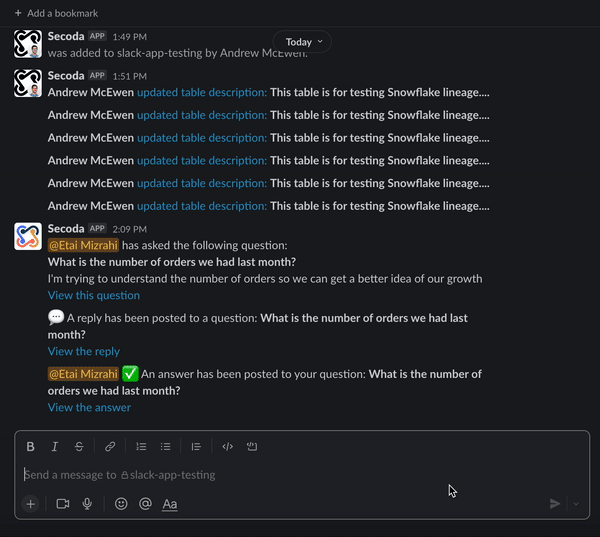

# Slack Integration with Secoda

## **Everything about the Secoda and Slack Integration** 

To connect Secoda to your Slack channel, follow the instructions here:&#x20;


[connect-to-slack.md](../getting-started/connect-to-slack.md)


### Search from Slack

To search Secoda from Slack, type /secoda into any channel or DM, followed by your search term. Once the results come up, you can open them to the page that you're looking for.&#x20;

### Ask Questions from Slack

First, you’ll need to connect Secoda to your Slack workspace following these instructions.&#x20;

After you’ve done so, anyone in your Slack workspace can ask a question using a Slack command: `/ask,` followed by their question.&#x20;

 (1) (1).png>)

From here, you'll be prompted to ask your question and submit information to follow up. If you're an admin, if you make a [question template](data-requests/templates.md) the default, the template will show up on this Slack question form.

You can view your asked questions by going into the Secoda app and going to the Questions tab or going to the Slack channel that has been set up to receive notifications from Secoda.&#x20;

When this question is answered, you'll receive a notification.&#x20;

.png>)

To respond to incoming and new questions, head to the Secoda app, click on questions, and you’ll see all of the questions that have been asked and answered.

### Slack Notifications

You can receive updates from Secoda in a Slack channel of your choice. If you're an admin, you'll receive notifications when documentation or schema changes. Anyone who is an owner or assignee on a question, document, or dictionary term will receive a notification when there has been an update or change related to that resource or any related resources.&#x20;


Not using Secoda to manage your data knowledge yet? Sign up for free [here](https://app.secoda.co) 👈

