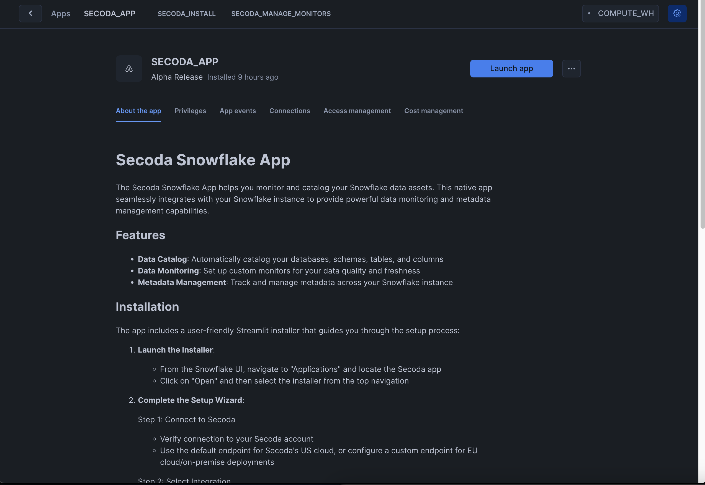
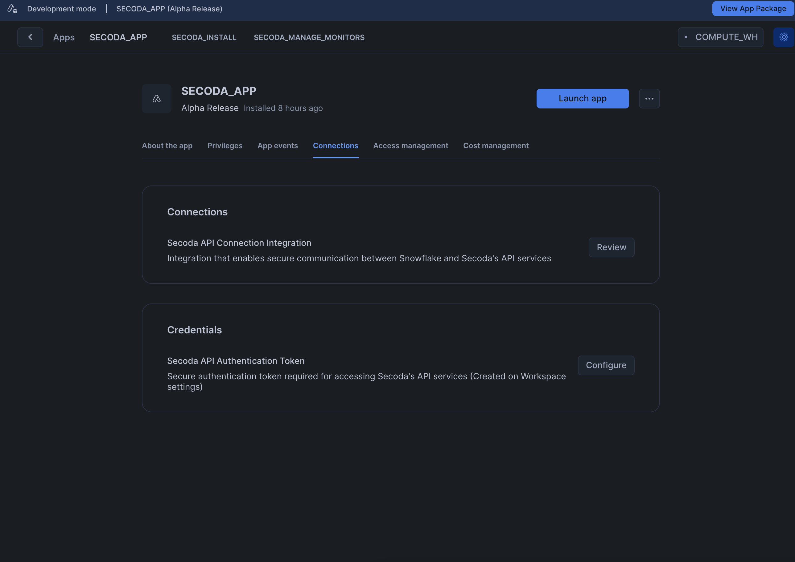
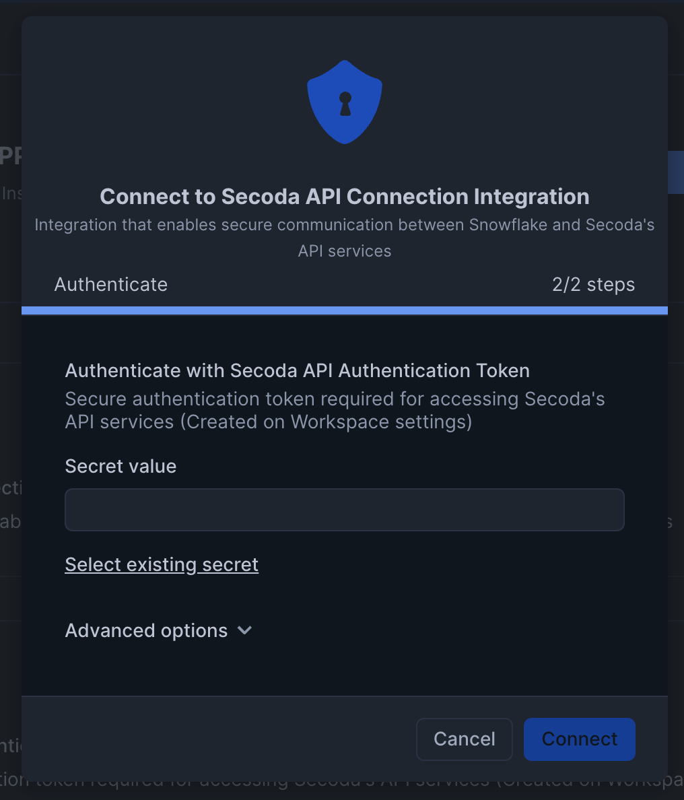
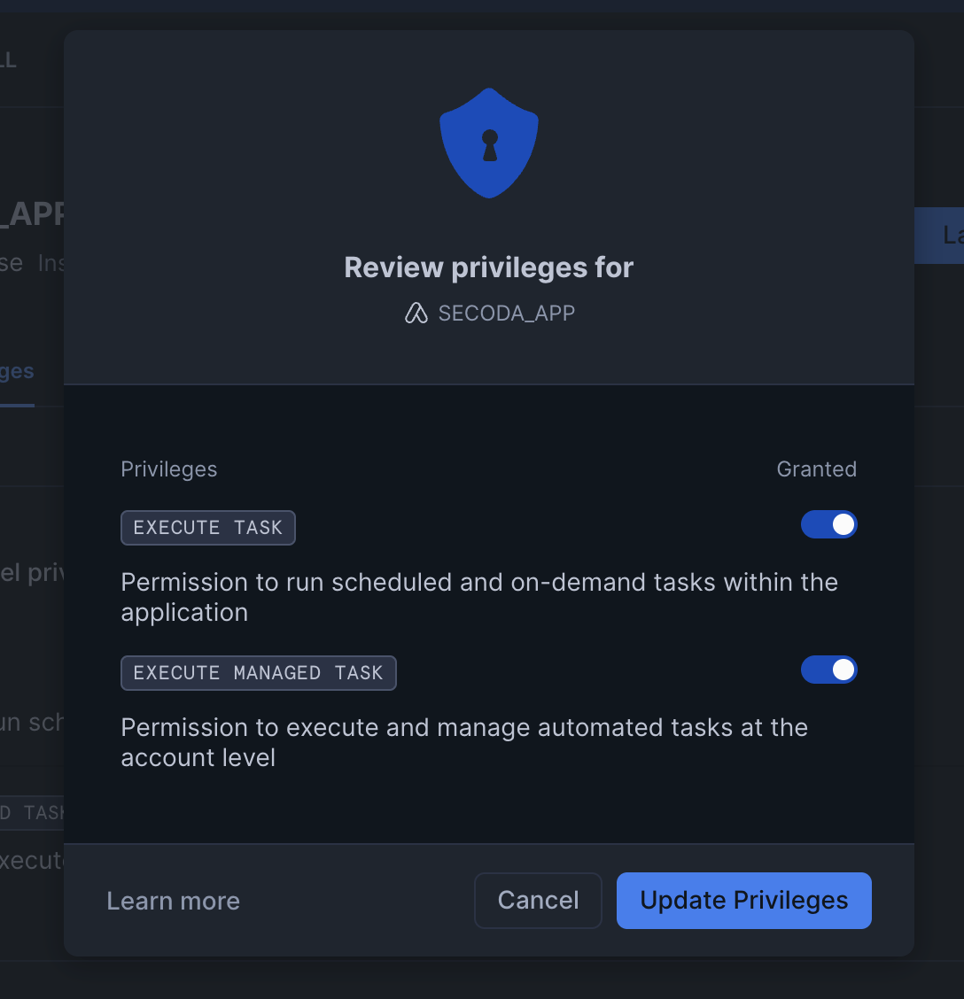
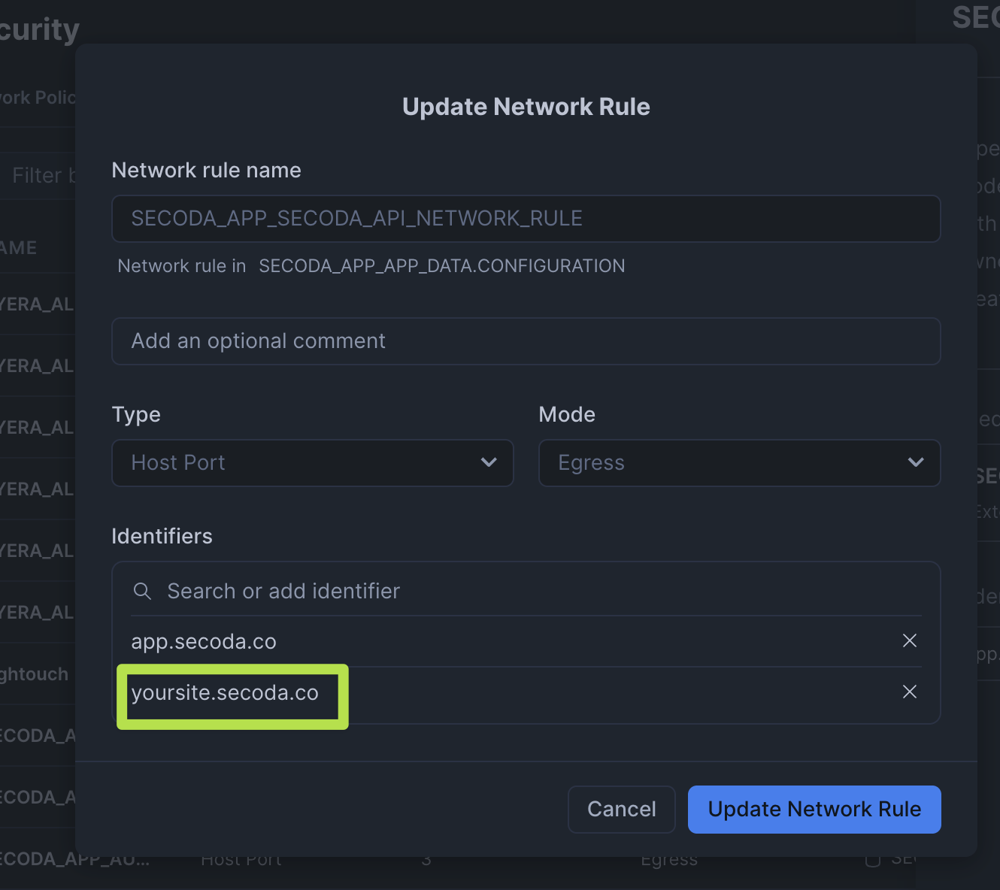
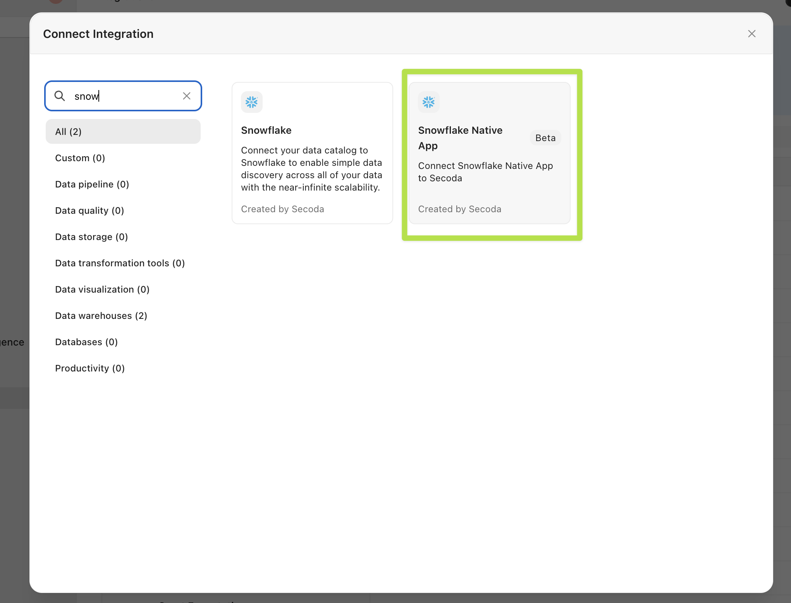

# Snowflake Native App


The Secoda Snowflake Native App is currently in early access. Features and functionality may change before the full release.


The Secoda Native Snowflake App enables you to integrate your Snowflake warehouse with Secoda without providing direct access to your Snowflake account. The native application runs securely within your Snowflake environment.


The Secoda Native App processes your data within your Snowflake environment and only sends metadata and limited processed information to Secoda's servers, allowing you to use Secoda's features without providing direct access to your raw data.


## Installation Process

To get started with the Secoda Native Snowflake App, follow these four steps:

1. Install the native app from Snowflake Marketplace
2. Configure the application's connection credentials
3. Set up network rules (if required)
4. Complete the setup process

### 1. Installing from Marketplace

You can install the app directly from the Snowflake Marketplace. Once installed, you will see the application interface:

<figure><figcaption><p>Secoda Native App Interface</p></figcaption></figure>

### 2. Configure Connection Credentials

Next, you'll need to configure the connection and provide account-level privileges:

1. Open the app and navigate to the Connections tab

<figure><figcaption><p>Connections Tab</p></figcaption></figure>

2. Enter your Secoda API key (You can generate an API key by visiting the "API" page under your workspace settings)

<figure><figcaption><p>API Key Entry</p></figcaption></figure>

3. Grant the necessary privileges to the application

<figure><figcaption><p>Required Privileges</p></figcaption></figure>

### 3. Network Rule Setup

By default, the native app can connect to Secoda's US Cloud service (app.secoda.co). If you use any other URL to access Secoda, you will need to create a network rule.


You can skip this step if you use Secoda at app.secoda.co


To create a network rule:

1. In Snowflake, navigate to Admin → Security → Network Rules
2. The network rule name depends on your app installation name
   * If you installed the app as `SECODA_APP`, the rule will be named `SECODA_APP_SECODA_API_NETWORK_RULE`
3. Add your custom Secoda endpoint to the network rule

<figure><figcaption><p>Network Rule Configuration</p></figcaption></figure>

### 4. Create Integration in Secoda

Before proceeding with the application configuration, you need to create a Native Snowflake integration in Secoda:

<figure><figcaption><p>Creating a Native Snowflake Integration in Secoda</p></figcaption></figure>

You will not need to configure any authentication for this integration. After creating the integration in Secoda, return to Snowflake and launch the "INSTALL\_SECODA" Streamlit program from the application header.

## Setup Wizard

The setup process guides you through three essential steps:

### 1. Connect to Secoda

* By default, the installation connects to Secoda's US cloud (app.secoda.co)
* Custom endpoint options are available for EU cloud, single-tenant, or on-premise deployments

### 2. Select Integration

* Choose which Secoda integration to use with your Snowflake data
* The app will list compatible Snowflake integrations from your Secoda account
* If no integrations exist, you'll need to create one in Secoda first

### 3. Configure Features

* **Catalog**: Enable to discover, explore, and document your Snowflake data assets
* **Monitor**: Enable to track data quality and freshness metrics


Once the setup is complete, your Secoda Native Snowflake App is ready to use!


## Using the Native App

You can interact with the Secoda Native Snowflake App in two ways:

1. **Streamlit-powered GUI**: A user-friendly interface for configuring and managing your integration
2. **SQL commands**: Execute SQL statements via a worksheet to perform the same operations

Most functionality available through the GUI can also be accessed via SQL commands, offering flexibility based on your team's preferences.

### Required Permissions

For each database you want to monitor or catalog, grant the following permissions:

```sql
-- Replace placeholders with your actual database, schema, and table names
GRANT USAGE ON DATABASE <your_database> TO APPLICATION secoda_app;
GRANT USAGE ON SCHEMA <your_database>.<your_schema> TO APPLICATION secoda_app;
GRANT SELECT ON TABLE <your_database>.<your_schema>.<your_table> TO APPLICATION secoda_app;
```

## Monitoring

The monitoring feature allows you to create data quality monitors that run within your Snowflake account using your Snowflake credits. Only the final calculated information is sent to Secoda.

Secoda tracks these metrics and can alert stakeholders when values exceed configured thresholds or when anomalies are detected.

### Creating Monitors

You can create monitors using SQL commands:

```sql
-- Create a new monitor
CALL SECODA_APP.MONITORING.CREATE_MONITOR(
    'monitor_key',               -- Monitor key
    'Table Row Count',           -- Name
    'Monitor table row count',   -- Description
    'row_count',                 -- Metric type
    'your_database',             -- Database name
    'your_schema',               -- Schema name
    'your_table',                -- Table name
    'daily',                     -- Schedule cadence
    6,                           -- Schedule hour (UTC)
    1,                           -- Schedule frequency
    'manual',                    -- Thresholds method
    1000,                        -- Max threshold
    0,                           -- Min threshold
    1                            -- Sensitivity
);
```

### Running Monitors

To manually run a monitor:

```sql
-- Run a specific monitor
CALL SECODA_APP.MONITORING.RUN_MONITOR('monitor_key');

-- View all monitors
SELECT * FROM SECODA_APP.MONITORING.LIST_MONITORS();
```

## Catalog


The Catalog functionality will be available soon.


When available, the Catalog feature will allow you to automatically discover, explore, and document your Snowflake data assets directly through the Native App.
