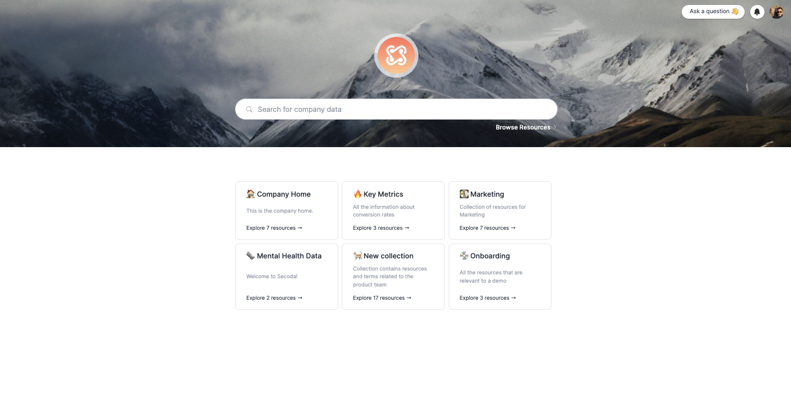

# Collections in Secoda

Collections are a way your data team to group resources together and organize your Secoda workspace by function. They can include tables, columns, dictionary terms, documents, and questions. Collections are often organized by:

* Team (e.g. Sales, Finance)
* Data Source (e.g. Tableau, Snowflake)
* Function (e.g. Onboarding)

Any pinned Collections that have been shared with you can be viewed on the home page.
