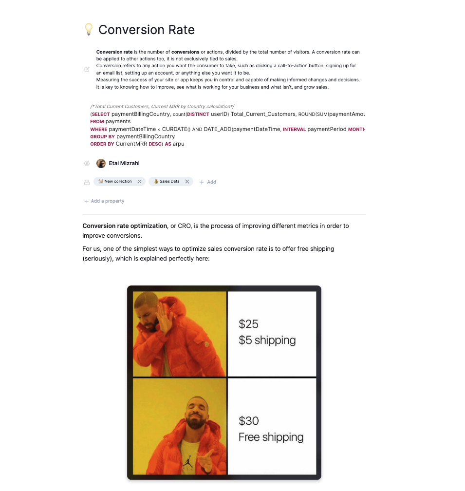

# Dictionary & Documents

### Dictionary

The data dictionary in Secoda is one place for all of your data terms. Terms in the data dictionary are accessible through Secoda’s search, and can be referenced in other resources in your workspace.

### Documents

Documents allow the data team to store context on collections, datasets, and tables in one place. Use this tab to find information about your organization’s data that is not directly tied to one specific table, term, or resource. Just like the data dictionary, all documents can be found using search, and can be directly linked in other resources in the workspace.
