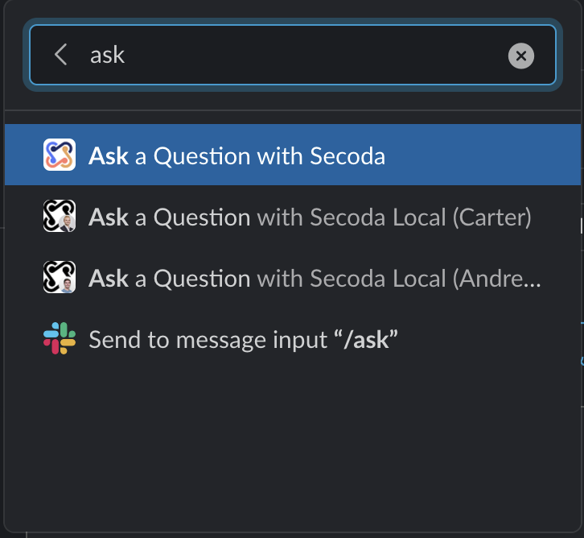

# Slack Integration

### Search from Slack

To search Secoda from Slack, type "/secoda" into any channel or DM, followed by your search term. Once the results come up, you can open them to access the page that you're looking for.&#x20;

.gif>)

### Ask Questions from Slack

To ask a question, use the Slack command "/ask" in any conversation, followed by your question.&#x20;

From here, you'll be prompted to ask your question and submit follow-up information.

You can view asked questions by going to the Questions tab in the Secoda app or going to the Slack channel that has been set up to receive notifications from Secoda.&#x20;

When this question is answered, you'll receive a notification.&#x20;

.png>)
